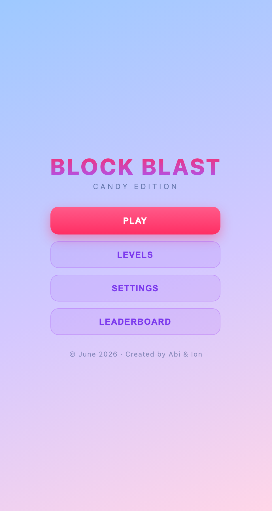
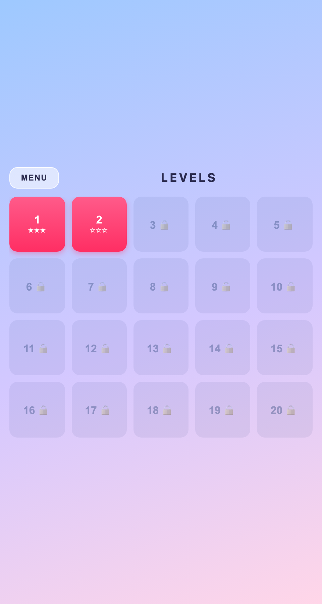
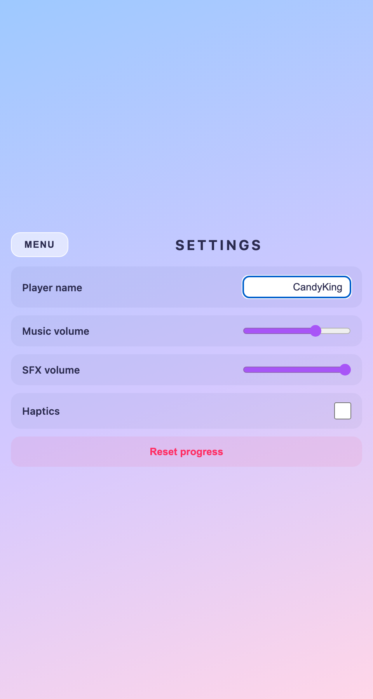
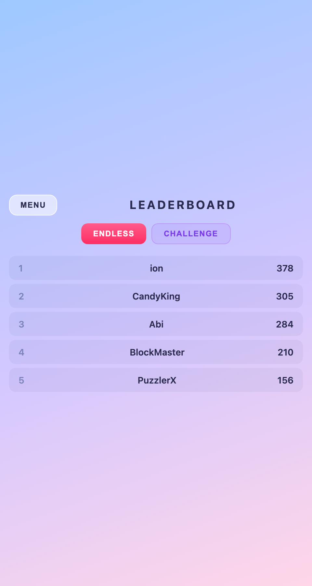
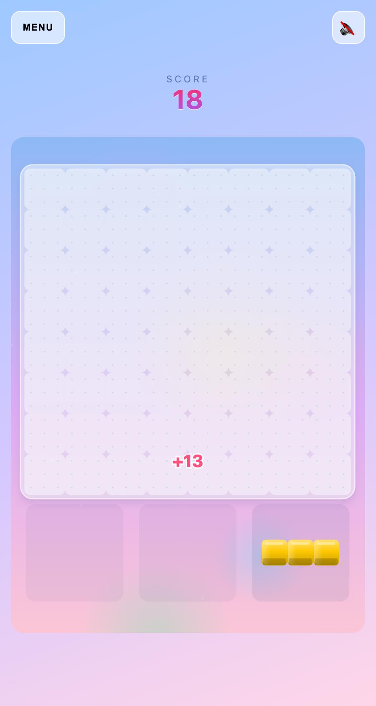
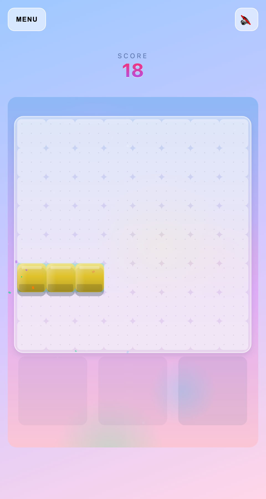
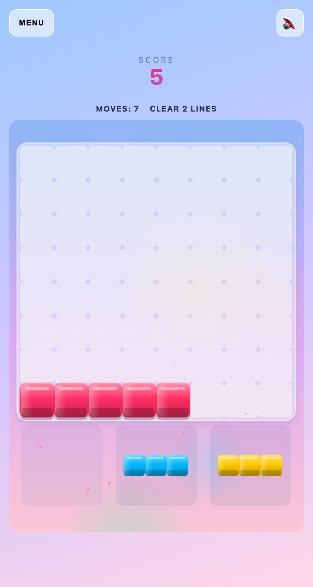
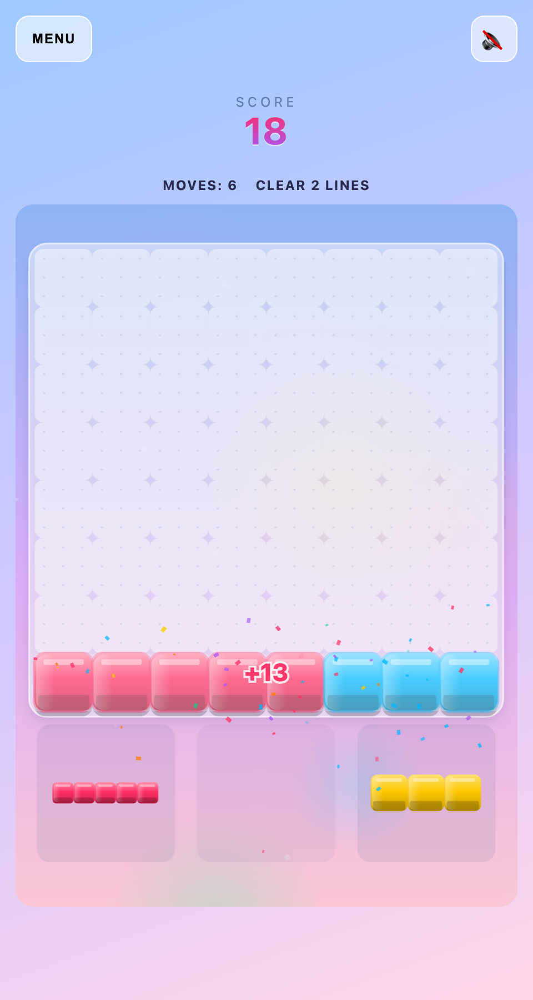
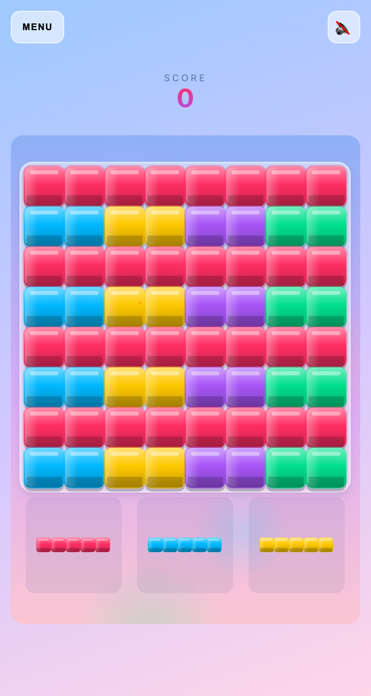
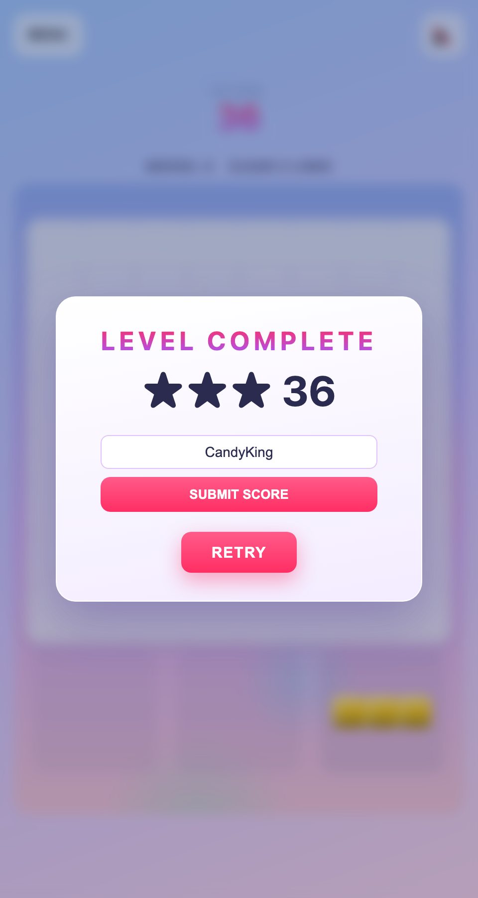

# Block Blast — Candy Edition 🍬

A juicy, candy-themed Block Blast clone built with vanilla JavaScript — no frameworks, no build step, zero runtime dependencies. Featuring glossy 3D candy blocks, full juice effects (screen shake, confetti, combo popups, drag trails), procedural sound effects, a background music loop, 20 star-rated puzzle challenges, persistent settings, and an online MongoDB-backed leaderboard with server-side anti-cheat.

**Play it live:** https://block-blast-clone-woad.vercel.app

---

## Screenshots

| | | |
|---|---|---|
|  |  |  |
| **Main menu** — Classic Column layout | **Level select** — 20 challenges, stars & locks | **Settings** — name, volumes, haptics, reset |
|  |  |  |
| **Leaderboard** — online top 10, Endless/Challenge tabs | **Endless mode** — glossy candy blocks | **Drag preview** — green/red ghost + sparkle trail |
|  |  |  |
| **Challenge mode** — moves & goal HUD | **Line clear** — white flash + confetti | **Game over** — score submission flow |
|  | | |
| **Level complete** — stars, score & submit | | |

---

## Features

### Gameplay
- **Endless mode** — the classic Block Blast experience on an 8×8 board, score as high as you can
- **20 puzzle challenges** — goal-based levels (`clear N lines` / `reach N points`) with a move budget
- **Star ratings** — 1★ complete, 2★ finish with moves left, 3★ finish with a third of the budget to spare; best stars are kept and levels unlock sequentially
- **Scoring** — `cells placed + 10·(lines·(lines+1)/2)` bonus per placement

### Graphics (all Canvas 2D, 60fps on mobile)
- Animated pastel gradient background with drifting bokeh orbs
- Glossy 3D candy blocks: specular highlights, bevels, glow rims, drop shadows
- Full juice: squash-and-stretch landing pops, confetti bursts, screen shake scaled by lines cleared, floating `+N` score popups, `COMBO ×N` text, drag sparkle trails, green/red ghost previews
- Frosted-glass board panel, dot-grid empty cells, candy-styled HUD and overlays

### Audio (100% license-free)
- **7 sound effects** generated procedurally with [jsfxr](https://github.com/chr15m/jsfxr) (a port of the classic sfxr) — regenerate/tune them via `tools/gen-sfx.mjs`
- **Background music** — "Pop 05" from [Mixkit](https://mixkit.co/free-stock-music/), free for commercial & personal use, no attribution required
- Separate music/SFX volume sliders, quick-mute button, persisted mute state

### Screens & Navigation
- Hash-routed SPA: `#/` menu · `#/levels` · `#/settings` · `#/leaderboard` · `#/play` (endless) · `#/level/N` (challenge)
- MENU button on every screen; game loop pauses when you leave a play screen

### Online Leaderboard & Anti-Cheat
- Top-10 board per mode (Endless / Challenge), MongoDB-backed via Vercel serverless functions
- Best-score-per-player upsert (`$max` on `{name, mode}`)
- **Server-side cheating protection:**
  - **HMAC one-time game sessions** — a signed 30-minute token is minted when a game starts and consumed on submission; replaying or tampering with a token → 401
  - **Per-IP rate limits** — 60 session mints/hour, 10 score submissions/hour → 429
  - **Score plausibility caps** — 10M (endless) / 1M (challenge)
  - Fail-closed: submissions rejected when the signing secret is unset; the public board stays readable

### Settings
- Player name (used for leaderboard submissions), music & SFX volume sliders, haptics toggle (`navigator.vibrate`), reset progress — all persisted in `localStorage` (private-mode safe, corrupt-data resilient)

---

## Tech Stack

| Layer | Technology |
|---|---|
| Frontend | Vanilla JS (ES modules), Canvas 2D, CSS |
| Backend | Vercel serverless functions (`/api/*`) |
| Database | MongoDB (`block-blast` db: `presence`, `leaderboard`, `game-sessions`, `rate-limit`) |
| Audio | jsfxr (procedural SFX), Mixkit music track, Web Audio API |
| Testing | node:test (unit), Playwright (e2e, desktop + mobile projects) |
| Deployment | Vercel native Git integration (auto-deploy on push to `master`) |

---

## Getting Started

```bash
git clone https://github.com/ionutale/block-blast-clone.git
cd block-blast-clone
npm install          # devDependencies only (Playwright, jsfxr)
npm run serve        # or: python3 -m http.server 4173
```

Then open http://localhost:4173 in your browser (mobile viewport recommended).

The `api/` folder requires a `MONGODB_URI` environment variable and a `SCORE_SECRET` (both set in Vercel for the deployed app) — the game itself works fully offline; only the online leaderboard and presence counter need them.

---

## How to Play

1. **Drag** pieces from the tray onto the board — they lock in place on release
2. **Complete rows or columns** (8 cells) to clear them and score
3. **Endless mode** (`PLAY`): survive as long as you can; the game ends when no piece fits
4. **Challenge mode** (`LEVELS`): reach the goal (lines or points) within the move budget
   - 1★ = complete · 2★ = moves left ≥ 1 · 3★ = moves left ≥ ⌈moves/3⌉
   - Completing a level unlocks the next one
5. **Submit your score** on the game-over / level-complete screen to enter the online leaderboard (enter a name up to 12 characters)

---

## Project Structure

```
├── index.html              # SPA shell: menu, levels, settings, leaderboard, game screens
├── css/style.css           # Candy theme styles
├── js/
│   ├── main.js             # App wiring: router handlers, screens, overlays, session handshake
│   ├── router.js           # Tiny hash router (parseHash, initRouter)
│   ├── game.js             # Game coordinator: endless + challenge modes, input, loop
│   ├── renderer.js         # Canvas 2D rendering + all juice effects
│   ├── board.js            # Pure board logic (place, clear, lines, game-over check)
│   ├── tray.js             # Piece tray logic
│   ├── shapes.js           # Piece shapes + candy color palette
│   ├── scoring.js          # Placement scoring (pure)
│   ├── input.js            # Pointer/touch input
│   ├── audio.js            # Sample-based audio engine (SFX + music loop, volumes, mute)
│   ├── levels.js           # 20 challenge definitions + star math
│   ├── storage.js          # localStorage: settings, progress, player name
│   ├── leaderboard.js      # Leaderboard API client + session handshake
│   └── online.js           # Online presence counter
├── api/                    # Vercel serverless functions
│   ├── heartbeat.js        # Presence heartbeat
│   ├── online.js           # Online player count
│   ├── leaderboard.js      # GET top-10 / POST verified submissions
│   ├── game-session.js     # HMAC session minting
│   ├── _db.js              # MongoDB client + collections + rate limiting
│   ├── _sessions.js        # Pure HMAC token helpers (unit-tested)
│   └── _util.js            # Client IP extraction
├── assets/
│   ├── sfx/*.wav           # 7 jsfxr-generated sound effects (committed)
│   └── audio/music.mp3     # Mixkit "Pop 05" background track
├── tools/gen-sfx.mjs       # Regenerates assets/sfx/*.wav from tuned jsfxr presets
├── e2e/                    # Playwright specs (core, lineclear, tray, gameover, menu, levels, settings, leaderboard)
└── screenshots/            # Gameplay screenshots (see README gallery)
```

---

## Testing

```bash
npm test              # Unit tests (node:test): board, tray, shapes, scoring, levels, storage, leaderboard, sessions, audio
npx playwright test   # E2E (Playwright, desktop + mobile): 19 specs × 2 projects
```

- Unit tests cover the pure game logic, star math, storage resilience (corrupt JSON, private mode), HMAC token crypto (round-trip, expiry, tamper, wrong secret), and leaderboard validation
- E2E specs drive real pointer drags via the debug bridge (`?test=1` exposes `window.__blockBlast`) and mock the API layer for offline-friendly runs
- Regenerate screenshots: `python3 -m http.server 4173 & node screenshots.mjs`

---

## Audio Pipeline

- **Sound effects:** `tools/gen-sfx.mjs` defines 7 tuned jsfxr presets (place, clear, combo, invalid, new tray, board full, game over) and renders them to 16-bit/22.05 kHz mono WAVs. Tweak the presets and re-run to retune.
- **Music:** `assets/audio/music.mp3` ("Pop 05" by Mixkit). License: free for commercial and personal projects, no attribution required (see [Mixkit license](https://mixkit.co/license/)).
- The engine decodes everything with `decodeAudioData` on first user gesture, plays SFX through a dedicated gain and loops music through a ducked gain, and persists mute/volume settings.

---

## Deployment

The project deploys to Vercel via the **native Git integration** — pushing to `master` auto-deploys. No GitHub Actions, no tokens:

```bash
git push origin master
```

Required Vercel environment variables:

| Variable | Purpose |
|---|---|
| `MONGODB_URI` | MongoDB connection string (leaderboard, presence, sessions, rate limits) |
| `SCORE_SECRET` | HMAC signing key for game sessions (set to `encrypted`) |

---

## Docs

Design specs and implementation plans live in [`docs/superpowers/`](docs/superpowers/):

- `specs/` — candy pop graphics, killer sounds, menu/levels/settings/leaderboards, anti-cheat designs
- `plans/` — task-by-task implementation plans used during development

---

## Credits

- Created by **Abi & Ion** (© June 2026)
- Block shapes inspired by Block Blast; this is an independent fan clone
- SFX generated with [jsfxr](https://github.com/chr15m/jsfxr) (MIT/Unlicense)
- Music: "Pop 05" via [Mixkit](https://mixkit.co/free-stock-music/)
- Built with vanilla JS, Canvas 2D, MongoDB and Vercel
